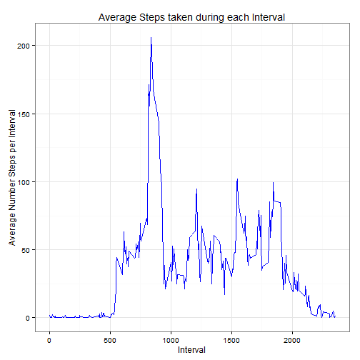
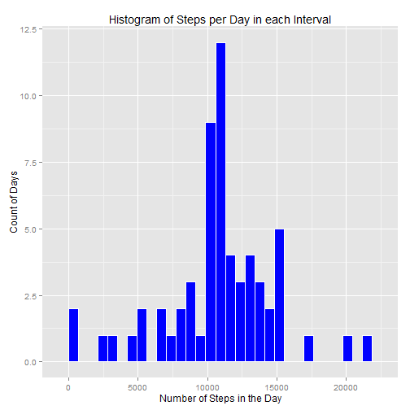
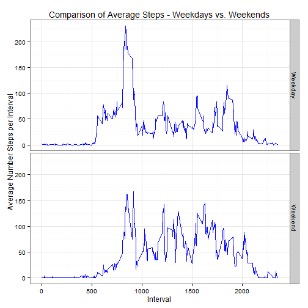

## Loading and preprocessing the data  
The data for this project was loaded using the `read.csv()` function wrapped 
inside a `dplyr` package `tbl_df()` function as some of the following analysis is being
done using `dplyr` functions.  Once the data has been read in, we want to ensure
that the Date variable is in Date format using `as.Date().`


```r
require(dplyr)
data <- tbl_df(read.csv(file = "activity.csv", stringsAsFactors = FALSE))
data$date <- as.Date(data$date)
```

## What is mean total number of steps taken per day?
An important aspect of this analysis is to first look at the distribution of the number of 
steps taken in each day.  A great way to visualize this is through the use of a Histogram
that divides the data into 'bins' that represent a range of steps taken in each day and then
count the number of days that fall into each bin.  
To achieve this, we must first summarize the data to calculate the total number of steps taken
in each day.  This can be done with the `dplyr` functions `group_by()` using the date variable
and then `summarize()` to calculate the sum of steps taken each day

```r
dataSteps <- data %>%
     group_by(date) %>%
     summarize(Steps_Per_Day = sum(steps))
```
With this summary completed, we can then plot the data as a Histogram.  For this plot we will use
the `ggplot2` package.

```r
require(ggplot2)
p1 <- ggplot(dataSteps, aes(Steps_Per_Day)) +
     geom_histogram(fill = "blue", color = "white") +
     labs(title = "Histogram of Steps per Day",
          x = "Number of Steps in the Day",
          y = "Count of Days")

print(p1)
```

 
  
The Histogram provides a quick glance at the distribution of the data and can to some extent provide
an estimate of the Mean and Median values.  To determine this specifically, we can use the `summary()`
function and only output the 3rd and 4th values of the 2nd column which are the Mean and Median values.
Using the following code segment we can see the Median and Mean values to be:  

Median :10765    
Mean   :10766  

```r
summary(dataSteps)[3:4, 2]
```

```
##                                     
## "Median :10765  " "Mean   :10766  "
```

## What is the average daily activity pattern?
Another aspect of the analysis is looking at the average number of steps taken during various periods
in the day.  The supplied data is recorded in 5-minute intervals, so we would like to look at the average
number of steps taken in each interval throughout the day.  We will again use the `group_by()` and `summarize()`
functions to create a data set that provides the Average Steps per Interval.

```r
stepsPerTime <- data %>%
     group_by(interval) %>%
     summarize(Average_Steps = mean(steps, na.rm = TRUE))
```
In order to visualize this output, we can use a line graph that plots the average steps taken in each interval
throughout the day.  

```r
p2 <- ggplot(stepsPerTime, aes(interval, Average_Steps)) +
     geom_line(color = "blue") +
     theme_bw() +
     labs(y = "Average Number Steps per Interval", 
          x = "Interval",
          title = "Average Steps taken during each Interval")

print(p2)
```

 
  
Note that the intervals are labeled 0 through 2355 which represent the 24-hour clock equivalent
of 0:00 through 23:55.  So, any interval on the resulting plot can essentially be decoded by placing the ":" symbol 
prior to the last 2 zeros - for example, 500 would be decoded to 5:00, 1000 decodes to 10:00 and so forth.  
By observation we can estimate the interval that has the greatest number of steps taken to be somewhere around 8:00 - 9:00. 
We can determine this specifically by sub-setting the data to show the interval with the maximum steps using the following
code segment which returns the Interval with the Maximum number of Steps which happens to be 835:

```r
stepsPerTime$interval[stepsPerTime$Average_Steps == max(stepsPerTime$Average_Steps)]
```

```
## [1] 835
```

## Imputing missing values
There are a number of missing values in the data that are represented as NA.  To find the number of rows that contain
missing values, the following code segment can be used to determine there are 2304 rows with missing values:

```r
sum(is.na(data$steps))
```

```
## [1] 2304
```
Given the number of observations in the data set, we can impute the missing values by using an averaging method of similar values.  For this part of the analysis, I have chosen to use the Average for each Interval to impute missing data. 

To accomplish this task, I first calculated the average steps in each interval;

```r
fixNA <- data %>%
     group_by(interval) %>%
     summarize(Mean = mean(steps, na.rm = TRUE))
```
then created a new data set so that we preserve the original data as is;

```r
dataFixed <- data
```
then used a `for()` loop to cycle through the data and replace all of the NA values with the Average for that
interval in the day.

```r
for (i in 1:nrow(data)) {
     dataFixed[i, 1] <- ifelse(is.na(data$steps[i]), 
                          fixNA[fixNA$interval == data$interval[i],2],
                          data$steps[i])
     
}
```
Now that we have an updated data set with the NA values replaced with the average for that Interval, we can 
recreate the Histogram plot from earlier to observe any change in the distribution of the data.  As we did
previously, the `group_by()` and `summarize()` functions are used to format the data and then a Histogram is 
generated from the newly created data set.

```r
dataFixedSteps <- dataFixed %>%
     group_by(date) %>%
     summarize(Steps_Per_Day = sum(steps))

p3 <- ggplot(dataFixedSteps, aes(Steps_Per_Day)) +
     geom_histogram(fill = "blue", color = "white") +
     labs(title = "Histogram of Steps per Day in each Interval",
          x = "Number of Steps in the Day",
          y = "Count of Days")

print(p3)
```

 
  
By comparison we can see that the Histogram has changed, but does not appear to be by too much.  There does appear
that there could be a shift upward in the Mean and Median values, so we should look at those values again to see if
there is a shift, and if so, by how much.  We will use the same `summary()` function as before to show this:

```r
summary(dataFixedSteps)[3:4, 2]
```

```
##                                     
## "Median :10766  " "Mean   :10766  "
```
We can now see by comparison that the Median and Mean values did not change by any significant amount. Previously we 
determined the values Median :10765   and Mean   :10766  , which are now showing values of Median :10766   and Mean   :10766  .

## Are there differences in activity patterns between weekdays and weekends?
One final analysis that would be interesting to see is if any change between activity on a Weekday versus a Weekend.
We can quickly analyze this by formatting our new data set that contains the imputed values to include a variable
for Weekday or Weekend to indicate which group the data belongs to.  We will then generate a new Line Graph that 
shows a comparison of the data in each group.  This will give us a quick visual of any changes in activity between
Weekdays and Weekends.  
The first step is to assign the Weekday or Weekend variable.  We will use the `mutate()` function to 
create the new variable by using the `ifelse()` function on `weekdays()` to parse out which group each observation
belongs to.

```r
dataFixed <- dataFixed %>%
     mutate(Weekday = ifelse(weekdays(dataFixed$date) == "Sunday" | 
                                  weekdays(dataFixed$date) == "Saturday",
                             "Weekend",
                             "Weekday"))
```
Using the updated data set, we can now create a line graph that shows the average Steps per Interval for Weekdays
or Weekends.  This again uses the `group_by()` and `summarize()` functions.  In order to create a separate Line Graph for
Weekdays and Weekends, the `ggplot2` `facet_grid()` function is used.

```r
stepsPerTimeFixed <- dataFixed %>%
     group_by(interval, Weekday) %>%
     summarize(Average_Steps = mean(steps, na.rm = TRUE))

p4 <- ggplot(stepsPerTimeFixed, aes(interval, Average_Steps)) +
     geom_line(color = "blue") +
     theme_bw() +
     facet_grid(Weekday ~ .) +
     labs(y = "Average Number Steps per Interval",
          x = "Interval",
          title = "Comparison of Average Steps - Weekdays vs. Weekends")

print(p4)
```

 
  
The resulting Line Graphs show that the maximum activity remains around 8:00 - 9:00 each day, but we can now see
that there is more activity during the weekends between 9:00 - 20:00 than there is during the weekday - which
makes sense.  A keen eye would also note that the activity on Weekends goes longer into the evening than it does 
on the Weekdays.
